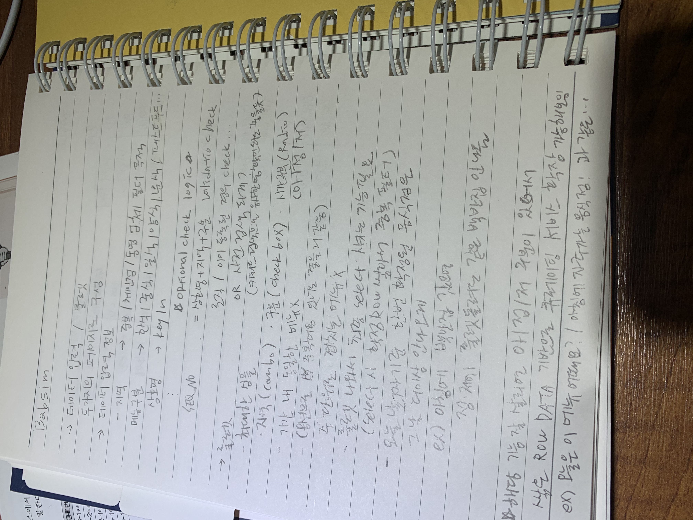
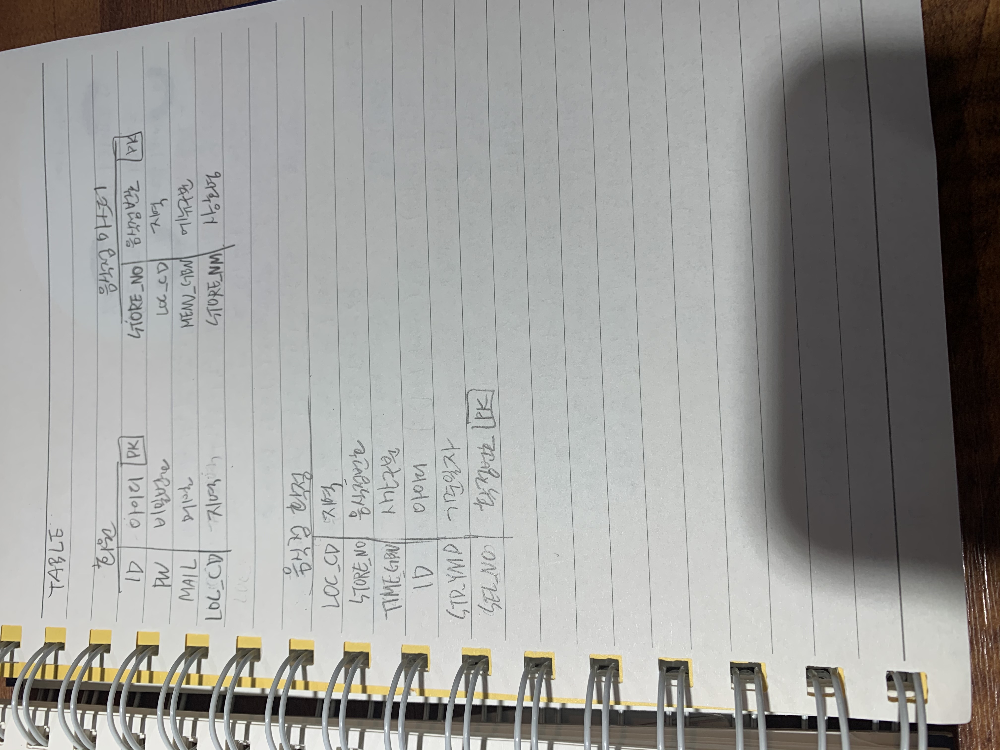
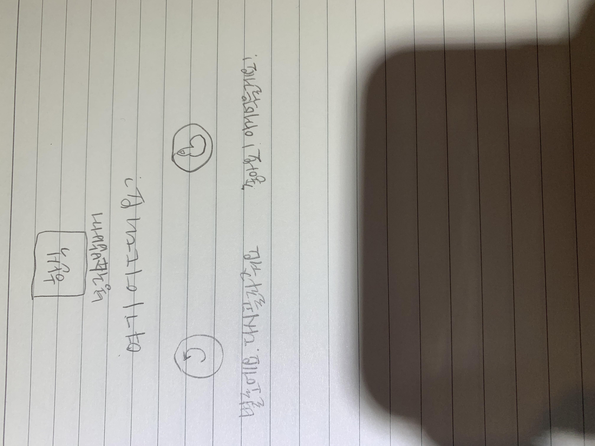

# 밥심 프로젝트

## 설계 전 프로토타입(이미지)
- 컨셉

- DB 테이블

- UI 디자인

 

## 설계(임시)
### 개요
- 페이지는 두 개로 구성
  - 데이터 입력 화면
    - 상호명 : key 값
    - SEQ_NO : 상호명+지역+구분
    - 추가 키 : 사전 검색 등 키워드로 확인 가능한 조건
    - 지역 : 체인점 여부, 동명 업체 필터
    - 메뉴 : 한식/중식/일식/양식/분식/패스트푸드 등

  - 룰렛 화면
    - 최대한 심플할 것 : 지역(Combo), 구분(Check), 식사시간 구분(Radio)
    - 특정 기간 내 동일한 메뉴 미출력
      - 옵션 체크박스로 기간 내 중복허용 가능
      - 주 단위로 겹치는 메뉴 미출력
    - 룰렛 후 결과 값을 최종 선택
      - 확정된 룰렛 결과는 Log로 기록
    - 당일 날짜 기준 한 번 확정된 음식점은 당일 더 이상 룰렛에서 나오지 않게 제거
      - ex) 아침에 백반집이라면 점심에 백반집이 나오지 않음

- 아침, 점심, 저녁 식사 구분으로 쌓인 데이터 기반으로 큐레이팅 서비스 확장 가능
  - ex) 오늘 이 메뉴 어때요? / 아침에 자주 가는 음식점!

 

### 테이블
- 비회원 관련 테이블 : 회원 관련 테이블 미포함
  - ~~메뉴 테이블~~
  - 코드 테이블
  - 음식점 테이블
  - ~~메뉴 확정 테이블~~

- 회원 관련 테이블 : 비회원 관련 테이블 포함
  - 회원 테이블
  - 리뷰 및 평점 테이블
  - 게시판 테이블 

 

### 개발 스택
- Front
  - Vue.js
  - Vuetify.js

- Back
  - Node.js
  - Express.js
  - cheerio.js
  - ~~scrypto.js~~ encrypt.js

- DataBase
  - MariaDB(MySQL)

 

## 참고
- 사용 라이브러리
  - Open API : kakao map
  - Crawling : nodejs cheerio
  - vue : vuetify
  - crypto : node scrypto

- 이슈
  - ~~vuetify css 미적용 이슈~~ *해결*
    - v-app 태그 하단에 정의해야 함

  - css 관련 UI설계서 작업 필요
